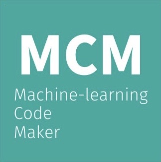

# MCM

URL：https://jphacks-2022-b2212.vercel.app/

## 製品概要
### 背景(製品開発のきっかけ、課題等）
- 昨今、インターネットやIoTなど情報通信技術の進歩により多種多様で大量のデータが得られるようになっており、「データサイエンス」は様々な社会において強く求められている
- しかし、データサイエンスを学ぶ上で、既存の学習教材では背景知識にこだわったり、特定の処理に限定したコードにのみ焦点があてられている場合が多く、初学者には全体的なデータ分析の流れを把握しながら自らコーディングを進めることが難しい

### 製品説明（具体的な製品の説明）
- 分析の流れ全体を俯瞰しながら、ユーザーのもつデータに合わせてコードを生成していくWEBアプリケーションを開発した
### 特長
#### 1. 特長1
- レンダリングが高速
#### 2. 特長2
- データ分析における全体的な流れを把握することができる
#### 3. 特長3
- Kaggleなどのコンペにおいて、上位モデルで採用され、「最強のアルゴリズム」の一つと呼ばれる“LightGBM; Light Gradient Boosting Machine”を用いた学習を行うことができる

### 解決出来ること
- データ分析における全体の流れを把握する
- 「聞いたことは忘れ、見たことは覚え、行ったことは理解できる」というように、データ分析の初学者の「実践」を大切にし、実務への応用やコンペに出場するまでのハードルを下げる
### 今後の展望
- WEBアプリケーション内にコーディング環境を構築する
- ユーザーのレベル別に「解説文」や「コード」を切り替えることができるようにする
- データベースとの接続を図り、責務を適切に設定したアーキテクチャを実現する
- テストの実装により、バグの防止、今後の開発コストの削減、パフォーマンスの向上を測る
### 注力したこと（こだわり等）
* 初学者に向けたシンプルなコード生成
* 学習に使用するモデルの充実

## 開発技術
### 活用した技術
#### フレームワーク・ライブラリ・モジュール
* React
* Flask

#### デバイス
* PC

### 独自技術
#### ハッカソンで開発した独自機能・技術
* 独自で開発したものの内容をこちらに記載してください
* 特に力を入れた部分をファイルリンク、またはcommit_idを記載してください。